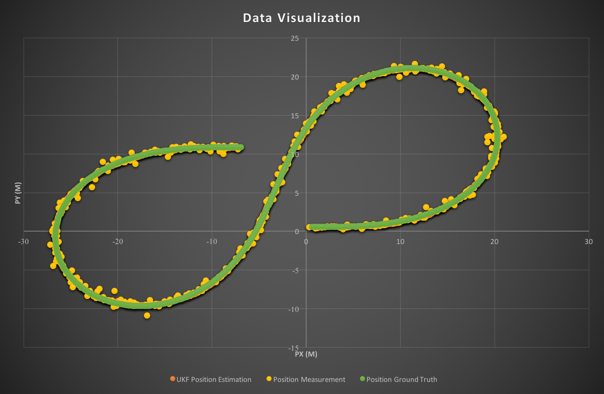

# SelfDrivingCar P7 Unscented Kalman Filter
[](http://www.udacity.com/drive)  
Udacity CarND Term 2  - Project 2 
---

## Dependencies

* cmake >= 3.5
 * All OSes: [click here for installation instructions](https://cmake.org/install/)
* make >= 4.1
  * Linux: make is installed by default on most Linux distros
  * Mac: [install Xcode command line tools to get make](https://developer.apple.com/xcode/features/)
  * Windows: [Click here for installation instructions](http://gnuwin32.sourceforge.net/packages/make.htm)
* gcc/g++ >= 5.4
  * Linux: gcc / g++ is installed by default on most Linux distros
  * Mac: same deal as make - [install Xcode command line tools](https://developer.apple.com/xcode/features/)
  * Windows: recommend using [MinGW](http://www.mingw.org/)

## Basic Build Instructions

1. Clone this repo.
2. Make a build directory: `mkdir build && cd build`
3. Compile: `cmake .. && make`
4. Run it: `./UnscentedKF path/to/input.txt path/to/output.txt`. You can find
   some sample inputs in 'data/'.
    - eg. `./UnscentedKF ../data/obj_pose-laser-radar-synthetic-input.txt output.txt`

## Files in the `src` Folder
* `main.cpp` - reads in data, calls a function to run the Kalman filter, calls a function to calculate RMSE
* `ukf.cpp` - initializes the filter, calls the predict and update function, defines the predict and update functions
* `tools.cpp` - function to calculate RMSE

## Data
The data file we are using is the same from EKF. Again each line in the data file represents either a lidar or radar measurement marked by "L" or "R" on the starting line. The next columns are either the two lidar position measurements (x,y) or the three radar position measurements (rho, phi, rho_dot). Then comes the time stamp and finally the ground truth values for x, y, vx, vy, yaw, yawrate.


## Simulation Results

Input file: `obj_pose-laser-radar-synthetic-input.txt`.

**At the beginning, the values for the process noise `std_a_` and `std_yawdd_` are both set to 30. I experiment with different process noise values to lower the RMSE. At the end, I am using 
```
std_a_ = 1.5;  
std_yawdd_ = 0.6;  
```
which make the RMSE meet the requirement `RMSE <  [.09, .10, .40, .30]`.**

### RMSE Outputs for the Sample Inputs

* Use both Radar and Lidar measurements  
The `px, py, vx, vy` output coordinates have an `RMSE = [0.0684438, 0.0825465, 0.336155, 0.218055]`.
* Use only Radar measurement  
The `px, py, vx, vy` output coordinates have an `RMSE = [0.155867, 0.219952, 0.368041, 0.321468]`.
* Use only Lidar measurement  
The `px, py, vx, vy` output coordinates have an `RMSE = [0.106743, 0.0979096, 0.607159, 0.251299]`.  

** From the above results, we can find that sensor fusion gives better results than using only one sensor type.**


### Performance Visualization
  

